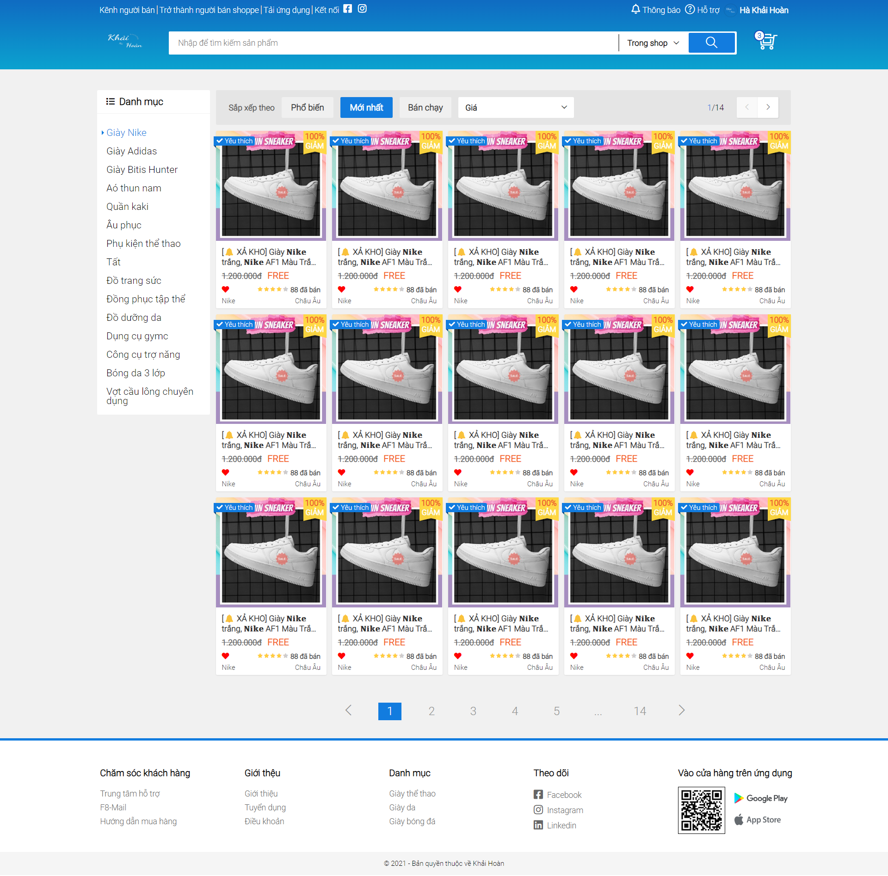

# My Second Website

Welcome to my second web development project where I've delved deeper into HTML and CSS to create a more refined experience.

## About

This website represents a leap forward in my journey as a web developer. Here, I've employed advanced HTML and CSS techniques to craft a more intricate and polished interface.

## Technologies Utilized

- HTML
- CSS

## Getting Started

To explore the website, simply open the `index.html` file in your preferred web browser.

## Contributions

I'm eager to receive any suggestions or enhancements for my code! Whether it's feedback or ideas, don't hesitate to open an issue or submit a pull request.

## Credits

Special thanks to [F8](https://fullstack.edu.vn/) for their invaluable tutorials and resources that have propelled my HTML and CSS skills.

## Website Preview

You can preview my website below or visit [F8Shopee](https://hoanha2101.github.io/F8Shopee/) for a more comprehensive view.

## Contact Information
   - UI Specialist: Ha Khai Hoan
   - Email: khaihoan.ai@gmail.com
   - GitHub: [Hoanha2101](https://github.com/Hoanha2101)
